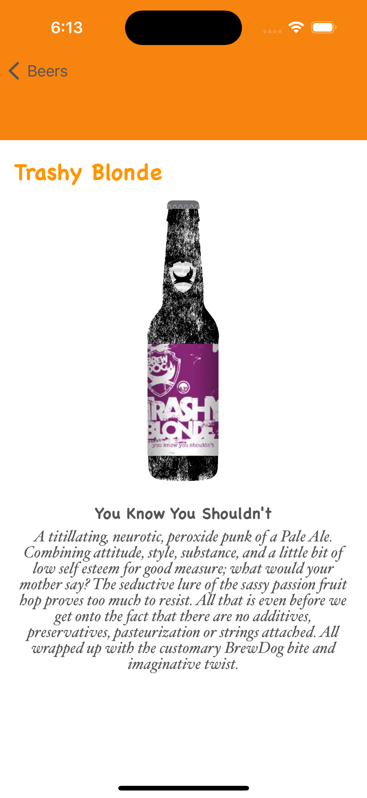

# O2O
Technical test for O2O

# Documentation:
- I have selected MVVM architecture.
- Calling to the API has been made without any third library.
- I added some others extra features: Details View, paginated search, filter by abv.

# How to test:

- Clone the project
- Run the project 
- Enjoy

# Screenshots
Home View and Home View filter

Details View IPA and no IPA product

Tips and Error Alert View

# Contact:

- [Linkedin](https://www.linkedin.com/in/olgargarrucho)
- [GitHub](https://github.com/olgargarrucho)
- [Twitter](https://twitter.com/olgargarrucho)

# License:

Copyright (c) 2023, Olga RG.
